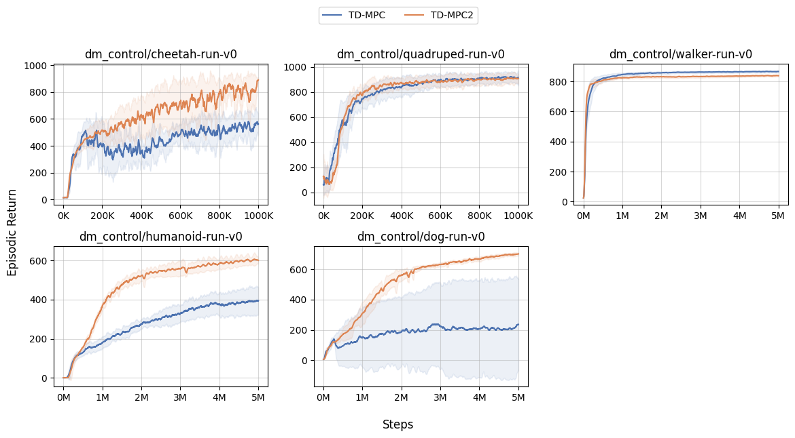
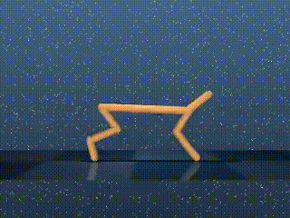
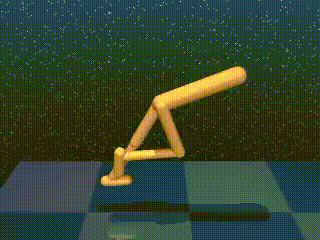
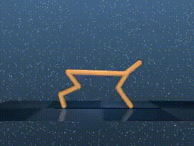
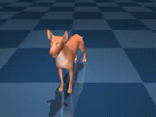

# Simple TD-MPCs

This is an implementation of [TD-MPC](https://arxiv.org/abs/2203.04955) and [TD-MPC2](https://arxiv.org/abs/2310.16828) using [JAX](https://github.com/google/jax)/[Flax](https://github.com/google/flax). While the official implementation of TD-MPC2 supports learning multiple tasks, this implementation focuses on simplicity and only supports learning a single task.

Inspired by [CleanRL](https://github.com/vwxyzjn/cleanrl), this implementation is designed to enhance readability by not dispersing the algorithm processing across multiple files, but rather organizing it within a single file to make the algorithmic flow easy to follow.

## Execution Results
Here are the test results of training in the [DM-Control](https://github.com/google-deepmind/dm_control) environment.

### Learning Curves

<div style="text-align: center">

</div>

### Animations

* Learning results by TD-MPC
<div style="text-align: center">
<figure>





</figure>
</div>

* Learning results by TD-MPC2
<div style="text-align: center">
<figure>





</figure>
</div>

## Environment Setup
Follow the steps below to set up the execution environment.

### Docker Setup

```
# Build the image
docker build -t simple_tdmpc .

# Start the container
docker run \
    --gpus all \
    -it \
    --rm \
    -w $HOME/work \
    -v $(pwd):$HOME/work \
    simple_tdmpc:latest bash
```

### Installation of Dependencies
Install dependencies using [Poetry](https://python-poetry.org/docs/).

```
poetry install
```

## Execution Methods

### Running TD-MPC

    ```
    poetry run python src/tdmpc.py 
    ```
### Running TD-MPC2

    ```
    poetry run python src/tdmpc2.py 
    ```

## Options

* Adding the `--capture_video` option allows saving videos of the training process in the `/videos` folder.

    ```
    poetry run python src/tdmpc2.py --capture_video
    ```

* The `--track` option enables recording of experiment logs through wandb.

    ```
    poetry run wandb login
    poetry run python src/tdmpc2.py --track --capture_video
    ```
    > If a 'transport failed error' occurs, execute the `git config` command displayed in the error message.

* The `--task` option allows switching the task for training.

    ```
    poetry run python src/tdmpc2.py --task 'dm_control/quadruped-run-v0' --total_timesteps 1000000
    ```

## Referenced Repositories

- [TD-MPC](https://github.com/nicklashansen/tdmpc)
- [TD-MPC2](https://github.com/nicklashansen/tdmpc2)
- [CleanRL (Clean Implementation of RL Algorithms)](https://github.com/vwxyzjn/cleanrl)